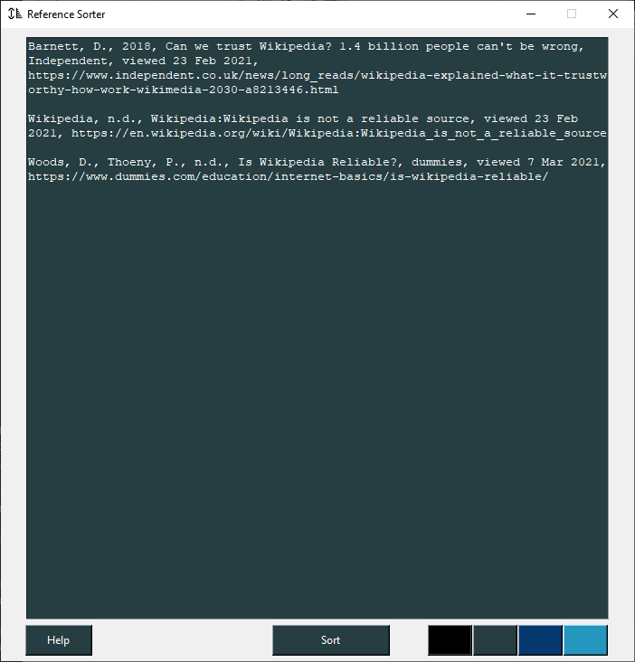

# Refernece-Sorter
Reference-Sorter is a python script which sorts a list of references for the user in alphabetical order ignoring all non-latin characters (A-Z and a-z only). Alongside the python script is a graphical user interface version using the Tkinter python library.



## Format Restrictions
Please note that any there should be **no new lines inside a single reference.** There may be however, a new line between references.

The following should work:
```
Barnett, D., 2018, Can we trust Wikipedia? 1.4 billion people can't be wrong, Independent, viewed 23 Feb 2021, https://www.independent.co.uk/news/long_reads/wikipedia-explained-what-it-trustworthy-how-work-wikimedia-2030-a8213446.html

Wikipedia, n.d., Wikipedia:Wikipedia is not a reliable source, viewed 23 Feb 2021, https://en.wikipedia.org/wiki/Wikipedia:Wikipedia_is_not_a_reliable_source
```

The following will **NOT** work (new line for the references):
```
Barnett, D., 2018, Can we trust Wikipedia? 1.4 billion people can't be wrong, Independent, viewed 23 Feb 2021,
https://www.independent.co.uk/news/long_reads/wikipedia-explained-what-it-trustworthy-how-work-wikimedia-2030-a8213446.html

Wikipedia, n.d., Wikipedia:Wikipedia is not a reliable source, viewed 23 Feb 2021,
https://en.wikipedia.org/wiki/Wikipedia:Wikipedia_is_not_a_reliable_source
```

## Usage - GUI
Simply run the sorter GUI by using the following command:
`python3 sorter_gui.py`

Paste the references into the text box provided (empty lines will be ignored) and click the sort button to sort the references.

**Shortcuts and other (Windows):**
- Change background colour: use coloured buttons on bottom right.
- Copy: ctrl + c
- Paste: ctrl + v
- Undo: ctrl + z
- Redo: ctrl + y

## Usage - Script
Simply create file containing the list of references (empty lines will be ignored). For this example, the file will be called 'references.txt'.

To sort the references simply use the command:
`python3 sorter.py references.txt`

The script will output a file called 'references (sorted).txt' which contains a sorted list of the provided references.

## Git Commit Convention
All new git commits use the convention found on [Semantic Commit Messages GitHub](https://gist.github.com/joshbuchea/6f47e86d2510bce28f8e7f42ae84c716) 